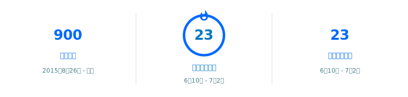

## 你好 👋

<table>
  <tr>
    <td align="center" valign="top">
      <strong>📊 GitHub 统计</strong> 
      
    </td>
    <td align="center" valign="top">
      <strong>💻 常用语言</strong> 
      
    </td>
  </tr>
</table>

<strong>🔥 连续贡献</strong> 

### 关于我

- 🔭 目前正在做 …
- 🌱 正在学习 …
- 💬 欢迎交流 …

### 联系我

- GitHub：[@trianglestrip](https://github.com/trianglestrip)

> 统计卡片为透明背景 + 高饱和配色，适配 GitHub 浅色 / 深色主题；数据由 Actions 每日自动更新。
