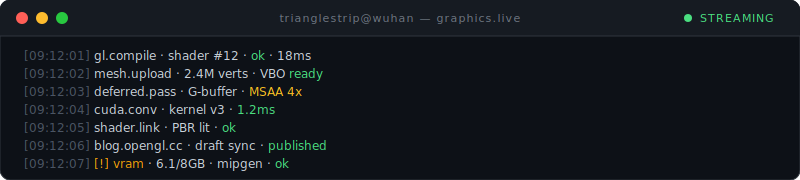
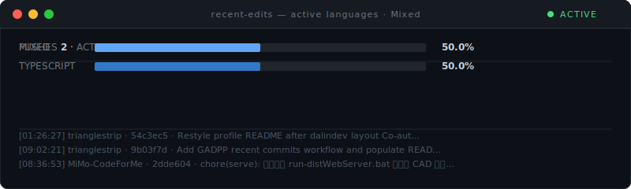
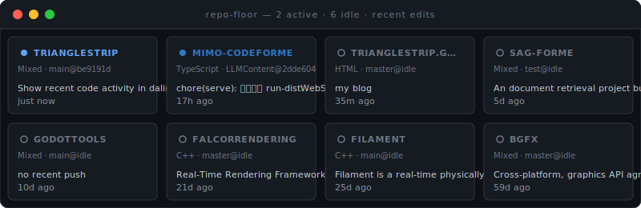

  

  

  

### 最近提交

<!-- START gadpp -->
**trianglestrip/MiMo-CodeForMe**
- 修复：刷新技能状态计算 · [70a7a60](https://github.com/trianglestrip/MiMo-CodeForMe/commit/70a7a608ada4197b655d0710575bb81c8bb6a5f8)
- 修复：使用本地 MiMo 模型配置 · [13d860a](https://github.com/trianglestrip/MiMo-CodeForMe/commit/13d860ad20a2cb0aa50acceb95e878b8cbad65ae)

**trianglestrip/SAG-ForMe**
- feat: 纳入知识库参考文档并增强 MiMo 代理与检索体验 · [bfe77e9](https://github.com/trianglestrip/SAG-ForMe/commit/bfe77e9d1295f2a9b46ab8fcda06618d2fba931d)
- docs: 重组文档目录并将 knowledge-base 加入 gitignore · [58eb544](https://github.com/trianglestrip/SAG-ForMe/commit/58eb5443a2c2ec9cf51ac66e00388688dd36f3af)
