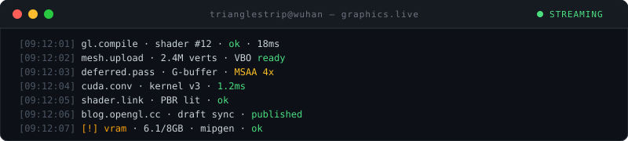
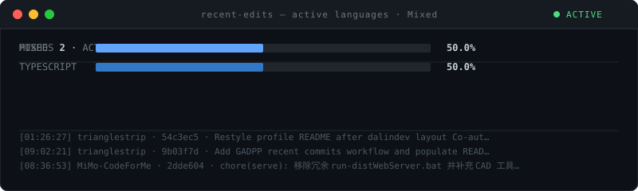
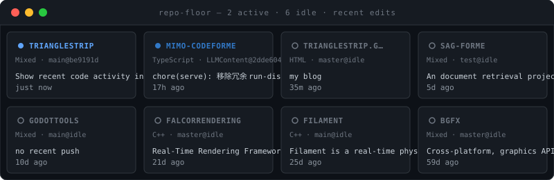

  

  

  

### 最近提交

<!-- START gadpp -->
**trianglestrip/MiMo-CodeForMe**
- feat(server): 图运行的专家静默完成，不再向父会话注入通知 · [4264fb5](https://github.com/trianglestrip/MiMo-CodeForMe/commit/4264fb53c961d9b936c46471e4a27b5881ba7bd8)
- fix(server): 专家团运行补会话存在性预检与 wait 超时语义 · [ecf1ddd](https://github.com/trianglestrip/MiMo-CodeForMe/commit/ecf1ddd1d132f49d839c1515b7fd74513c53efbc)

**trianglestrip/assimp**
- fix: streaming upload races + overlap buffer creation with parse · [953c555](https://github.com/trianglestrip/assimp/commit/953c555fbf729ad5093e640081aa362ad416e7d0)
- perf: stream geometry to GPU during parse (inline copies on parser work… · [c64d78d](https://github.com/trianglestrip/assimp/commit/c64d78d0e68d72ee84219a63ec2a48eb3214425b)

**trianglestrip/FalcorRendering**
- Fix linearZ slope in GBufferRT (#434) · [eb540f6](https://github.com/trianglestrip/FalcorRendering/commit/eb540f6748774680ce0039aaf3ac9279266ec521)
- Fix rasterization memory leak. (#459) (#461) · [33477f7](https://github.com/trianglestrip/FalcorRendering/commit/33477f758b9282af2fb6e98db555930f395fc6ac)
