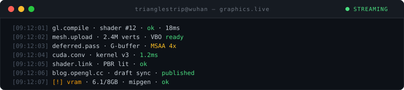
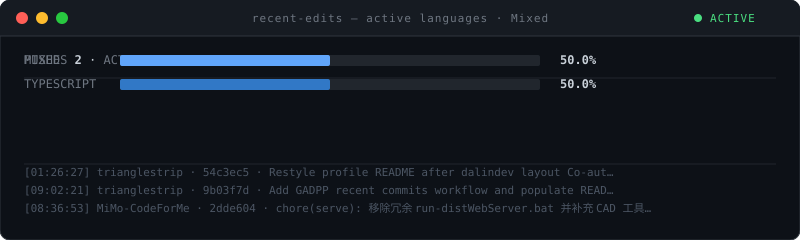
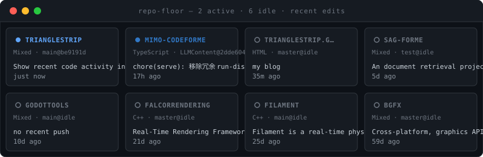

  

  

  

### 最近提交

<!-- START gadpp -->
**trianglestrip/tidewater**
- Faster startup (no blocking pipeline compiles) + Chinese localization · [2b89a44](https://github.com/trianglestrip/tidewater/commit/2b89a44103c31a03ebed58f847c078758e52f576)
- Backwash: no ruled line at the draining sheet's edge · [4811ba4](https://github.com/trianglestrip/tidewater/commit/4811ba48d795197de5621985f404e765c0b7c0ef)

**trianglestrip/deepseek-harness**
- Merge pull request #4469 from deepseek-harness/worktree/release-dsh-0.1… · [ddefc45](https://github.com/trianglestrip/deepseek-harness/commit/ddefc45fbc7f8e46dd73185e68295696d1297887)
- release(dsh): 0.1.6-alpha.2 · [6b1808f](https://github.com/trianglestrip/deepseek-harness/commit/6b1808f432adfa96ab6c2f033e158ca230422e16)

**trianglestrip/dsh-xb-plugins**
- docs: spec the four remaining desktop tasks · [ddfd998](https://github.com/trianglestrip/dsh-xb-plugins/commit/ddfd998829edfbba9876b7722fdf461818388c08)
- feat(dev): one verification pass and a build runbook · [416f2a5](https://github.com/trianglestrip/dsh-xb-plugins/commit/416f2a53d5632cc0eb014e47de7b6ed9adc60d3e)
